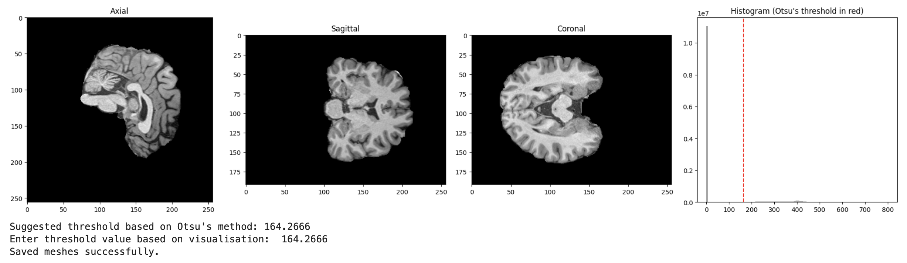
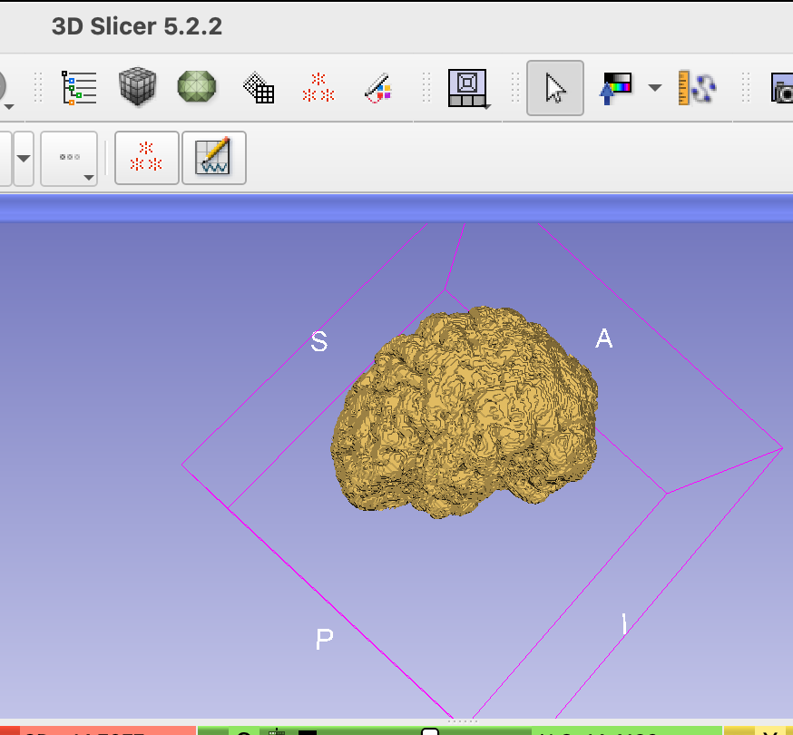
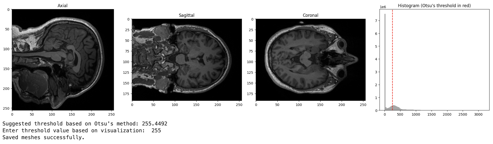
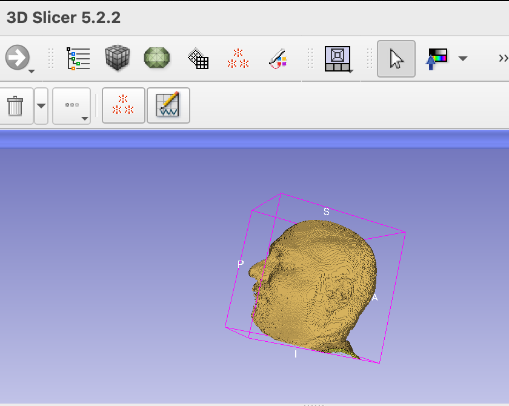

# HeadMesh_MRI
Recently, patients and participants have been increasingly asking if they could 3D print their T1 MRI images. So here is a python script that uses nifti (.nii) inputs and outputs head meshes in .stl .ply and .vtk. Scroll down for details:

## Output Visualisation (for extracted brain)

## .stl output in Slicer

## Output Visualisation (for head & neck)

## .stl output in Slicer

So what does this code do:

Modules:
   - `nibabel`: to read NIfTI 
   - `numpy`:Numerical computations 
   - `matplotlib`: Plotting
   - `skimage`: Image processing library
     - `measure`: extract surface meshes from 3D data
     - `filters`: image filtering and thresholding
     - `morphology`: mathematical morphological operations.
   - `vedo`: 3D visualisation and writing.
   - `label`, `regionprops`: From `skimage.measure` to identify and analyse connected components

   #### *I added image visulisation here just for insopection/fun, you should have inspected the image before. Axial, sagittal, and coronal views of the brain are displayed. 
   #### * I also added the Otsu's method to get a data-driven threshold suggestion, but kept the otption to input any threshold value you wish to chose. 
   

**Thresholding using Otsu's Method**:
   - A histogram of the brain image intensities is plotted.
   - Otsu's thresholding is a method that tries to find the threshold that minimises the intraclass variance (the variance within each of the two groups of pixels determined by the threshold).
   - The red dashed line on the histogram indicates the Otsu's threshold, providing a suggested thresholding value.
   - 
**Binary Mask Creation**:
   Based on the threshold decided (either from Otsu's method or user's chosen value), the data is converted to a binary mask, where voxel values greater than the threshold are set to 1 and others to 0.

**Morphological Closing**:
   The code then applies a morphological closing operation to the binary mask. This operation helps to fill small holes in the binary data, essentially 'smoothing out' the mask. The `morphology.ball(3)` creates a spherical structuring element, which dictates how the closing operation is applied.

**Labeling and Cleaning**:
   - The binary data is labeled to identify connected components.
   - The code then finds and keeps only the largest connected component (usually the brain), filtering out smaller noise or artifacts. This is a typical step in neuroimaging pipelines to remove small clusters that aren't part of the main structure of interest.

**Mesh Extraction**:
   Using the marching cubes algorithm, the code generates 3D surface meshes from the binary data. Two meshes are generated:
   - **Hollow Mesh**: Created from the cleaned binary data (after morphological operations and keeping only the largest connected component).
   - **Full Mesh**: Created from the original binary data.

**Saving the Meshes**:
   Both meshes are saved in multiple formats: `.vtk`, `.stl`, and `.ply`.

### Suggestions for Enhanced Accuracy:

- **Iterative Refinement**: You can apply the thresholding operation iteratively. e.g., after an initial threshold is applied and unwanted artifacts are removed, they could run the thresholding operation again to refine the mask further.
  
- **Adaptive Thresholding**: Instead of a single global threshold, consider using adaptive or local thresholding techniques that compute thresholds in local neighbourhoods. This can handle varying intensity profiles within the image.

- **Post-processing**: After thresholding, consider further post-processing steps like dilation, erosion, or more advanced morphological operations to refine the binary mask.

### Why did I add both hollow and full:

Depends on your resaerch purpose. In neurosurgery, eplipesy, neuromodulation etc. head and neck meshes are important (full mesh). On the otehr hand, if you are just using the mesh for visualisation or 3D printing it makes more sense to create hallow meshes.  Printing a hollow mesh consumes less material and hence is cheaper and faster.

This code was inspired by Dr. Chris Rorden's matlab script https://github.com/rordenlab/spmScripts/blob/master/nii_nii2stl.m.

Also note that my preferred method is to use SimNIBS. SimNIBS uses "charm" to segment the brain (also uses recon all) and then uses gmsh to create mesh files that are super accurate and high quality. In case you have .msh files and want to convert to .stl you can use this: 
gmsh "$msh_file" -o "$stl_file" -format stl
  
Remy Cohan, 2023

